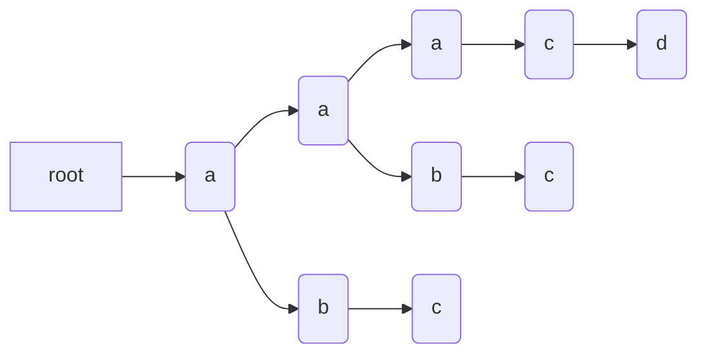

#### 字符串分析算法

- **字典树**：大量高重复字符串的存储与分析
- **KMP**（三位发明家的名字首字母）：在长字符串中找模式
- **WildCard**：简易版正则，带通配符的字符串模式（？任意字符，\*任意数量的任意字符）
- **正则表达式** regexp：字符串通用模式匹配
- **状态极**：通用的字符串分析
- **LL LR**：字符串多层级结构分析

##### 字典树

1. 根节点不包含字符，除根节点外每一个节点都只包含一个字符；
2. 从根节点到某一节点，路径上经过的字符连接起来，为该节点对应的字符串；
3. 每个节点的所有子节点包含的字符都不相同。

```
  aaacd aabc abc 生成如下字典树 👇
```



##### KMP

- 常用于在一个主串 S 内查找一个模式串 P 的出现位置
- 减少重复的字符匹配
- 匹配失败时，回到失配字符对应的 next 值，继续匹配。
- next 数组创建规则同 kmp，模式串 P 看作主串，前缀看作 P，不匹配时，j = table[j]

| 模式串    | a   | a   | b   | a   | a   | a   | c   | c   |
| --------- | --- | --- | --- | --- | --- | --- | --- | --- |
| next 数组 | 0   | 0   | 1   | 0   | 1   | 2   | 2   | 0   |

##### wildCard

- \* 匹配大于等于 0 长度的任意字符串
- ？匹配任意字符
- 最后一个 \* 匹配尽量多字符串，其余 \* 匹配尽量少字符串

##### 动态规划 dp[ i ][ j ]

- 局部最优 -> 全局最优
- 0/1 背包问题
- 当前项 i 选择或不选择
- dp[i-1][j]：不选择 i 时的最优值
- dp[i][j-wi]：减去当前重量的最优值
- max(dp[i-1][j],dp[i][j-wi]+vi)

##### 其他

- 取 min ~ max 之间随意数字：Math.random( ) \* ( max - min ) + max
- ```
  String.fromCharCode(76) // “L”
  String.fromCharCode(76.1111) // “L”
  String.fromCharCode(76.9999) // “L”
  ```
- ```
  // node[key] === false | 0 | undefinded | null
  if( node[key] ){}

  // 相对严谨
  if(key in node){}
  ```
