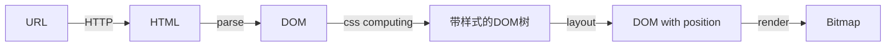
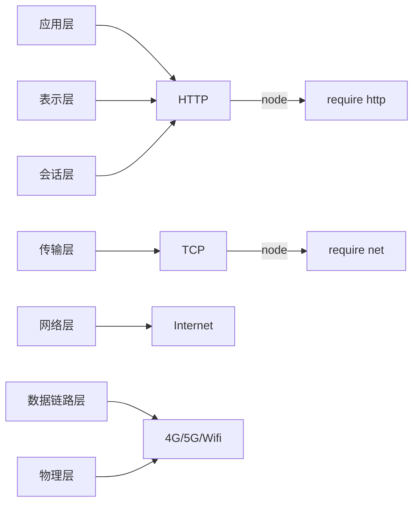

### 浏览器工作原理



### 状态机（有限状态机）

- 每一个状态都是一个机器
  - 在每一个机器中，可以做计算、存储、输出
  - 每一个机器接受的输入是一致的
  - 每一个机器本身没有状态，如果用函数表示的话，应该是纯函数（无副作用：不受外部的输入控制）
- 每一个机器都知道下一个状态
  - 有确定的下一个状态（Moore）
  - 根据输入决定下一个状态（Mealy）

#### JS 中的状态机（Mealy）

- 一系列返回值为状态函数的状态函数

```javascript
// 每个函数是一个状态
function state(input) {
  // 一系列操作
  return next; // 返回值作为下一个状态
}

/**** 调用👇 ****/
while (input) {
  // 获取输入
  state = state(input);
}
```

### HTTP 的协议解析

- ISO-OSI 七层网络模型



- **实现流程**
  - HTTP 请求
    1. 设计一个 HTTP 请求的类 `Request`
    2. content-type 是一个必要的字段
    3. body 是 KV 格式
    4. 不同的 content-type 会影响 body 格式
  - send 函数
    1. 将真实数据发送到服务器
    2. 异步，返回一个 promise
  - 发送请求
    1. 支持已有的 connection 或者新建自己的 connection
    2. 收到的数据传给 parser
    3. 根据 parser 的状态 reslove promise
  - ResponseParser
    1. response 需要分段构造，所以用 responseParser 来装配
    2. responseParser 分段处理 responseText，所以可以用状态机来解析。
  - BodyParser
    1. Response 的 body 根据 Content-Type 有不同的结果，所以采用子 parser 来处理
    2. 以 TrunkedBodyParser 为例，用状态机来处理 body 的格式

### 其他

- 四种常见的 **POST** 提交数据方式
  1. application/x-www-form-urlencoded
  2. application/json
  3. application/form-data
  4. text/xml
